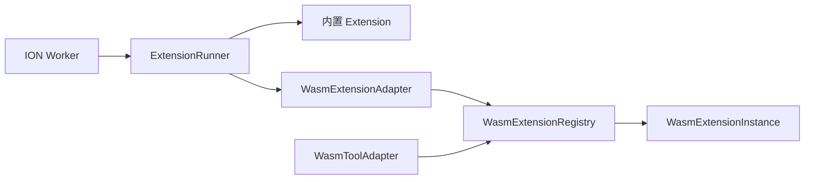

# ION Extension 系统

> **状态：已验证** — 内置 Extension 生命周期调度、运行时 WASM 加载、热更新与四维存储已经实现；本文定义两类 Extension 的边界和当前 ABI。

## 1. 术语与边界

ION 只有两类 Extension，接口语义一致，区别仅在代码的装载位置：

| 类型 | 代码位置 | 装载方式 | 主要实现 |
|------|----------|----------|----------|
| 内置 Extension | ION Rust 二进制 | 编译时链接，配置决定是否启用 | `Extension` trait + `ExtensionRunner` |
| 运行时 WASM Extension | 独立 `.wasm` 文件 | 启动自动发现、单次加载或 RPC 热加载 | `WasmExtensionRegistry` + `WasmExtensionInstance` |

命名职责固定如下：

- `Extension`：两类 Extension 共同遵守的生命周期接口。
- `ExtensionRunner`：按顺序执行已注册 Extension 的生命周期钩子；它不是安装目录或 WASM 实例注册表。
- `WasmExtensionRegistry`：以规范化文件路径管理当前 Worker 已加载的 WASM 实例。
- `WasmExtensionInstance`：单个 Wasmtime 实例、Store、Memory 与工具集合。
- `WasmExtensionAdapter`：把 WASM 生命周期导出适配为 `Extension` trait。
- `WasmToolAdapter`：把 LLM 工具调用转发给对应 WASM 实例。

JSON 描述文件不是第三种 Extension 类型。`--extension` 只接受 `.wasm`。



## 2. 身份、版本与状态

三个容易混淆的字段必须分开：

| 概念 | 当前来源 | 示例 |
|------|----------|------|
| Extension ID | `.wasm` 文件名去掉后缀 | `hello_extension` |
| ABI 版本 | `extension_version() -> u32` | `1` |
| 发行版本 | Extension 自己的 `Cargo.toml` / MANUAL | `0.1.0` |

`extension_version()` 返回的是 ABI 兼容版本，不是包的发行版本。RPC `extension_list` 因此返回字段 `abi_version`。

状态术语：

- **installed**：产物位于全局或项目 Extension 目录。
- **loaded**：当前 Worker 已实例化该 WASM 模块。
- **enabled**：配置允许自动发现，或内置 Extension 未被关闭。

`ion extension list` 查询已安装文件；RPC `extension_list` 查询当前 session 所属 Worker 已加载的实例。两者不能混用。

## 3. 内置 Extension 执行模型

内置能力实现 `src/agent/extension.rs` 中的 `Extension` trait，并注册到 `ExtensionRunner`。Runner 负责：

- 生命周期钩子的确定性顺序执行；
- 可变上下文、通知类和阻断类钩子的统一调度；
- 权限、UI、文件系统与 `StorageContext` 能力注入；
- 运行时 flag 值的查询与设置。

基础设施进入内核；行为策略进入 Extension。多个无关 Extension 都会复用的能力，先在内核实现，再经 `ExtensionApi` 或 WASM host function 暴露。

## 4. WASM ABI v1

### 4.1 基础导出

最小工具型 Extension 导出：

```rust
#[no_mangle]
pub extern "C" fn extension_version() -> u32 { 1 }

#[no_mangle]
pub extern "C" fn extension_init() {
    // 调 host_register_tool 注册工具。
}

#[no_mangle]
pub extern "C" fn extension_execute_tool(
    name_ptr: *const u8,
    name_len: u32,
    args_ptr: *const u8,
    args_len: u32,
    out_buf: *mut u8,
    out_capacity: u32,
) -> u32 {
    // 返回实际写入 out_buf 的字节数。
    0
}
```

可选生命周期钩子统一使用 `extension_` 前缀：

- 可变上下文：`extension_on_<hook>(json_ptr, json_len, out_buf, out_capacity) -> u32`
- 单向通知：`extension_on_<hook>(json_ptr, json_len)`
- 状态/阻断：`extension_<hook>(json_ptr, json_len) -> u32`
- 私有 RPC：`extension_on_rpc(method_ptr, method_len, params_ptr, params_len, out_buf, out_capacity) -> u32`

缺少可选导出表示“不参与该钩子”。当前加载器只识别 `extension_*` 符号，不提供废弃前缀的兼容路径。

### 4.2 Host 能力

Host functions 按能力而非具体 Extension 组织：

| 类别 | 代表函数 |
|------|----------|
| 工具 | `host_register_tool` |
| 通信与编排 | `host_send_message`, `host_channel_send`, `host_create_worker` |
| UI | `host_ui_ask`, `host_ui_confirm`, `host_ui_notif`, `host_ui_alert`, `host_ui_prompt` |
| 文件系统 | `host_read_file`, `host_write_file`, `host_list_dir`, `host_path_exists`, `host_glob` |
| Agent 状态 | `host_get_token_count`, `host_get_messages`, `host_get_state`, `host_steer`, `host_inject_follow_up` |
| 内核服务 | `host_llm_call`, `host_get_worker_status`, `host_compact_now`, `host_create_worktree` |
| 数据 | 四个维度的 read/write/delete/list |

以 `src/wasm_extension.rs` 的 Linker 注册代码为 ABI 真相源。新增共享能力时先补内核 API，再更新脚手架、本文和测试。

## 5. 四维数据存储

Extension 只能通过 Host API 访问自己的数据目录，不应自行拼接 `~/.ion` 路径。

| 维度 | 函数形式 | 作用域 |
|------|----------|--------|
| `global` | `host_{read,write,delete,list}_global_data` | 本机所有项目 |
| `project` | `host_{read,write,delete,list}_project_data` | 当前项目，项目外存储 |
| `project_local` | `host_{read,write,delete,list}_project_local_data` | 当前项目 `.ion/`，可随项目迁移 |
| `session` | `host_{read,write,delete,list}_session_data` | 当前 session |

写入使用临时文件加 rename；同一实例由 Mutex 串行，跨进程冲突采用 last-write-wins。完整安全边界见 [Extension Host API](./EXTENSION_HOST_API.md)。

## 6. 发现、安装与热更新

```bash
# 创建与构建
ion extension create hello-extension
cd hello-extension
cargo build --target wasm32-wasip1 --release

# 全局安装并查看已安装文件
ion extension install ./target/wasm32-wasip1/release/hello_extension.wasm
ion extension list

# 单次进程加载
ion --extension /absolute/path/to/hello_extension.wasm "调用 hello"

# 已有 Worker 热加载并查看真正加载的实例
ion rpc --session <sid> --method extension_add \
  --params '{"path":"/absolute/path/to/hello_extension.wasm"}'
ion rpc --session <sid> --method extension_list
```

热更新以规范化绝对路径为键。`extension_reload` 会替换该路径对应的实例；正在执行的工具通过 `Arc` 持有旧实例直至调用结束，之后自动释放。

## 7. 开发与验证契约

开发操作的唯一入口是 [Extension 开发与接入工作流](../guides/EXTENSION_WORKFLOW.md)。每个运行时 Extension 的源码目录必须包含按 [Extension 手册模板](../templates/EXTENSION_MANUAL_TEMPLATE.md) 编写的 `MANUAL.md`。

最低交付要求：

1. 用 FauxProvider Factory 写 Harness 集成测试。
2. 用 `#[ignore]` + `ION_E2E=1` 保留真实 LLM case。
3. 提供 `tests/<extension>_ci.sh`，通过 CLI/RPC 验证加载、调用、错误和可观察状态。
4. 对外状态同时提供 Push、Pull 与多终端同步；确实不适用时在 MANUAL 中说明。
5. 先直调 `call_tool` / `extension_rpc` 验证核心路径，再验证 LLM 自主调用。

仓库级 Extension 基础设施回归：

```bash
cargo test --test wasm_extension_tests
bash tests/extension_cli_ci.sh
```

## 8. 源码与示例导航

| 路径 | 职责 |
|------|------|
| `src/agent/extension.rs` | `Extension` trait 与 `ExtensionRunner` |
| `src/wasm_extension.rs` | WASM ABI、实例、注册表与适配器 |
| `src/worker_api.rs` | 内核向内置 Extension 暴露的能力 |
| `src/storage_context.rs` | 四维存储上下文 |
| `tests/wasm_extension_tests.rs` | WASM 加载、工具与 Host API 回归 |
| `extensions/hello-extension/` | 最小脚手架级示例 |
| `extensions/todo-extension/` | 带状态与手册的完整示例 |
| `extensions/file-time-guard/` | 生命周期钩子和私有 RPC 示例 |
| `extensions/session-supervisor/` | Agent 生命周期和 steer 示例 |
| `extensions/stock-extension/` | 最小通信型示例 |

具体 Extension 的工具、事件、配置和测试只写在它自己的 `MANUAL.md`；本文只维护平台契约，避免出现互相冲突的接入说明。
